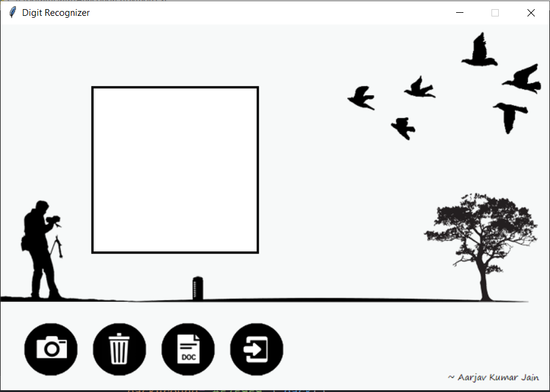
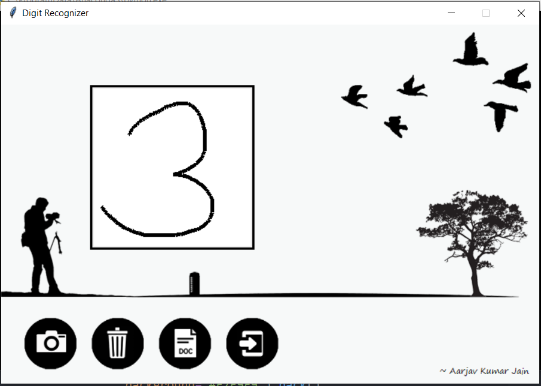
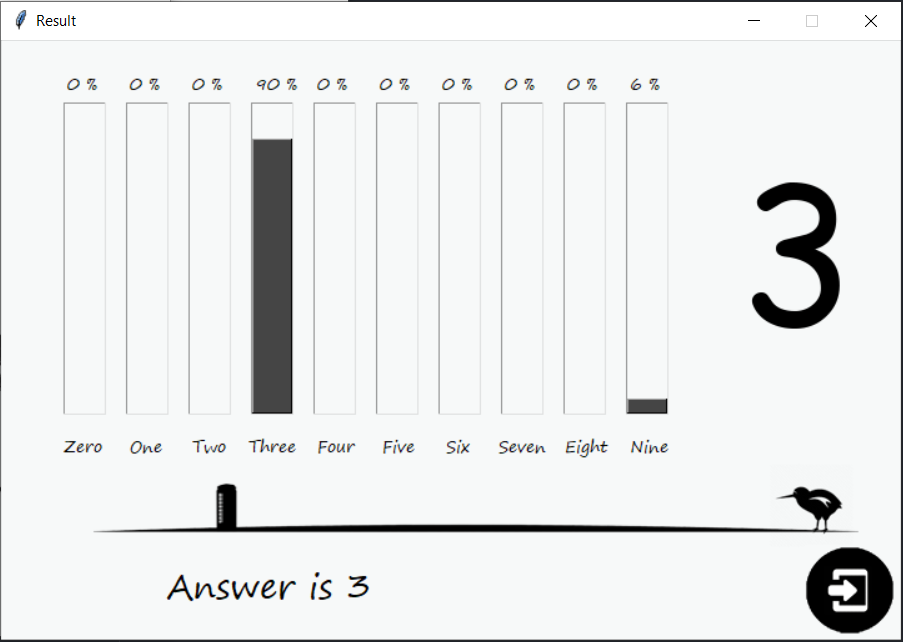
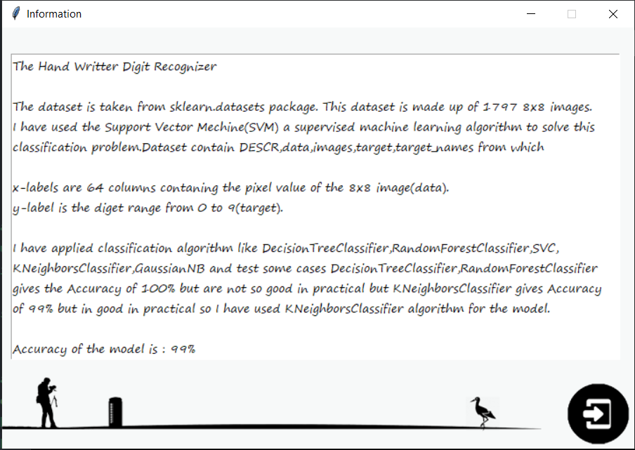

# Handwritten Digits Recorgnizer

## A Tkinter based GUI application that predicts the digit written on its canvas.

### Requirements
  1. tkinter
  2. PIL
  3. time
  4. pickle
  5. skimage

## Steps
<b> Main Window</b>

<b>Write a number from 0-9 on thw white canvas</b>

<b>Click on the Highlighted (Camera) button it will open New Window with the Predictions Results</b>

<b>The Result Window will appear like this showing the percentage of accuracy of each number</b>

<b>To Remove the Written text or number click on the highlighted (Delete) button it will clear the canvas</b>

<b>To Get the Information click on the Highlighted (Info) button</b>

<b>It will Display the following Information</b>

